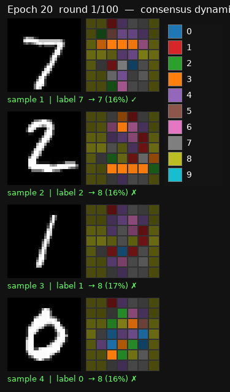

# Adaptive Consensus Networks

A lean **Sheaf-ADMM consensus network** for MNIST classification. 49 agents on a
7×7 grid — each owning a 4×4 image patch — negotiate a global digit prediction
through sheaf-structured communication over 84 edges. The whole unrolled ADMM
solver is trained **end-to-end** by backpropagation through the rounds.

<p align="center">
  
</p>

> Each frame is one ADMM round (K=100 at inference). Agents are colored by the
> digit they currently vote for (brightness = confidence). Watch the population
> converge from disagreement to consensus across the rounds. Four correctly
> classified test samples are shown.

## Results

| Metric | Value |
|---|---|
| Test accuracy (MNIST) | **96.52%** |
| Parameters | **31,837** |
| Agents / edges | 49 / 84 |
| ADMM rounds (train / eval) | K=20 / K_eval=100 |
| Latent / channel dim | d=16 / k=8 |

## Architecture

```
image (1×28×28)
   │  patchify (4×4, stride 4)  →  49 patches × 16 px
   ▼
SharedEncoder (MLP)            ← each agent: patch(16) + pos code(8) → objective params
   │  outputs per-agent local objective {q_diag, q, l1_weight}  (lasso mode)
   ▼
┌──────────────────────── Unrolled Sheaf-ADMM (K rounds) ────────────────────────┐
│  x-update  : diagonal-prox soft-thresholding  (local Lasso solve, exact)        │
│  z-update  : unrolled conjugate-gradient on sheaf Laplacian + hard ker(F) proj  │
│  u-update  : dual ascent  (u ← u + x − z)                                       │
│  restriction maps F_ij ∈ R^{k×d} : per-edge learned sheaf maps (84 edges)       │
└─────────────────────────────────────────────────────────────────────────────────┘
   │  decode readout (x) per agent  →  logits + confidence
   ▼
Confidence-weighted voting across the 49 agents  →  fused digit prediction
```

### The agents

The 28×28 image is split into a 7×7 grid of non-overlapping 4×4 patches. Each
patch is owned by one **agent** (a "column"). Neighboring agents are connected
by undirected grid edges (4-connected → 84 edges), and they communicate by
exchanging **sheaf restriction maps** `F_ij ∈ R^{k×d}` that project each agent's
`d`-dimensional latent state into a shared `k`-dimensional channel (`k < d`).

### The solver: Sheaf-ADMM

Each round runs three steps, all differentiable so gradients flow end-to-end:

1. **x-update (local solve)** — each agent minimizes its own convex objective.
   In the default `lasso` mode this is a diagonal quadratic + L1 solved exactly
   by the **diagonal-prox soft-thresholding operator** (no inner iterations). A
   legacy `quadratic` mode (`Q = L Lᵀ + εI`) uses a closed-form Woodbury solve.

2. **z-update (consensus)** — agents reconcile via the sheaf Laplacian
   `L_s = Bᵀ diag(F) B`. The default `cg_project` mode runs an **unrolled
   conjugate-gradient** solve with a hard `ker(F)` projection
   (`z = z_target − (L_s + εI)⁻¹ L_s z_target`, driving `Fz → 0`). A legacy
   `gd` mode uses plain gradient-descent sheaf diffusion.

3. **u-update (dual ascent)** — `u ← u + x − z`, the standard ADMM dual update.

The ADMM penalty `ρ` and diffusion step `lr_z` are **learnable** scalars (kept
positive via softplus).

### Reference-frame code & confidence-weighted voting

- **`d_pos` (reference-frame / "where" code):** a 2D sinusoidal positional
  encoding (grid-cell-like location signal) appended to each agent's input,
  binding every column's features to a location in the shared reference frame.
- **Confidence-weighted voting:** each agent emits a scalar confidence in
  `[0,1]`; the final prediction weights each column's vote by its confidence
  (normalized across the population) instead of a uniform mean.

### Turning disagreement into a learning signal

The ADMM disagreement is reused as an auxiliary learning signal:
- **sheaf edge-energy** `‖F_ij z_i − F_ji z_j‖²` regularizer
  (`edge_energy_weight`)
- **dual disagreement** `‖u‖²` regularizer (`disagreement_weight`)

Plus a **per-round cross-entropy auxiliary** so every round's fused vote is a
valid prediction (linearly ramped from early to late rounds).

## Project layout

```
adaptive_consensus/
├── config.py     # ModelConfig (architecture) + TrainConfig (optimizer/data/viz)
├── graph.py      # 7x7 grid, patchify, sinusoidal reference-frame code
├── model.py      # AdaptiveConsensusModel: encoder, restriction maps, ADMM solver
├── train.py      # training loop, loss, eval, checkpointing
└── viz.py        # per-epoch consensus-evolution GIF (PIL)
train_adaptive_consensus.py   # convenience CLI launcher
tests/test_adaptive_consensus.py
results/adaptive_consensus/
├── checkpoint.pt
└── viz/epoch_020.gif          # the GIF shown above
```

## Quickstart

```bash
# install
pip install -e ".[dev]"

# train (defaults: 20 epochs, K=20 train / K_eval=100 eval)
python train_adaptive_consensus.py

# common overrides
python train_adaptive_consensus.py --epochs 20 --d 32 --k 8 --K 15
```

Training writes a `checkpoint.pt` and one consensus-evolution GIF per epoch to
`results/adaptive_consensus/`.

### Key hyperparameters

| Flag | Default | Description |
|---|---|---|
| `--K` | 20 | ADMM rounds for training |
| `--K-eval` | 100 | ADMM rounds for eval/inference |
| `--T` | 5 | inner CG steps per z-update |
| `--d` / `--k` | 16 / 8 | agent latent dim / channel dim |
| `--objective-mode` | `lasso` | `lasso` (diagonal-prox) \| `quadratic` (Woodbury) |
| `--z-solver` | `cg_project` | `cg_project` (hard ker(F)) \| `gd` (soft diffusion) |
| `--dec-readout` | `x` | decode local proposal `x` \| consensus `z` |
| `--d-pos` | 8 | reference-frame code dim (0 = off) |
| `--edge-energy-weight` | 0.01 | sheaf edge-energy regularizer weight |

## Tests

```bash
pytest -q
```

Covers grid structure, patchify, forward shapes & gradients, convergence log,
reference-frame code wiring, confidence-weighted vs uniform voting,
differentiable disagreement signals, the lasso diagonal-prox soft-thresholding
operator, the CG projection reducing edge energy, and the legacy quadratic+gd
path.
